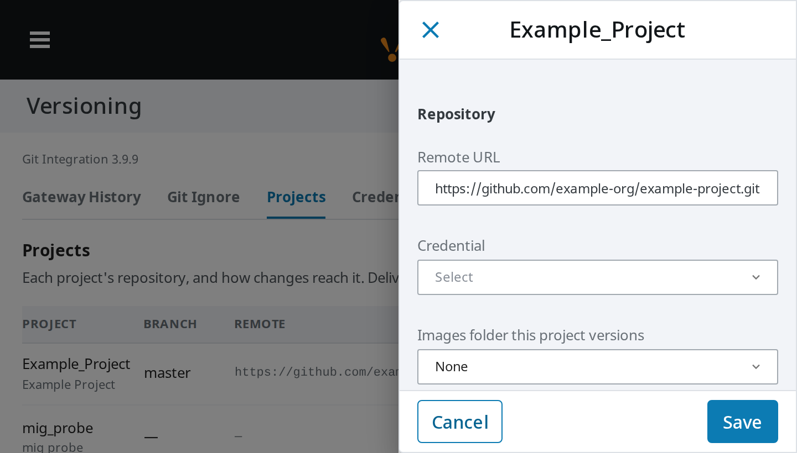
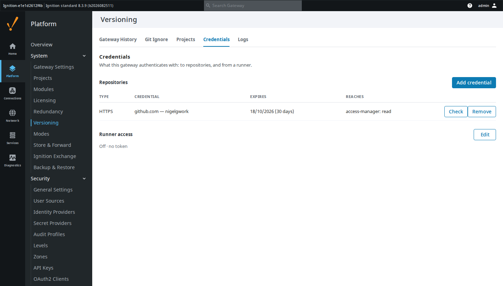
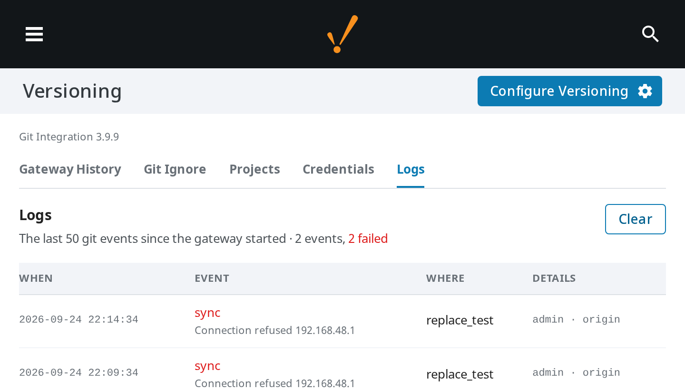

# Git Integration

Version control for Ignition 8.3 — project resources from the Designer, gateway
configuration from the gateway. A Gaskony build of
[OperaMetrix's Git module](https://github.com/operametrix/ignition-git-module),
under the Beerware licence.

## Why this exists

Two people editing the same gateway is two people overwriting each other, and a
gateway backup is a snapshot, not a history: it cannot tell you what changed
between Tuesday and Friday or who changed it. Ignition has no built-in answer,
so the answer is the one every other trade already uses — put it in git.

Upstream covers the Designer half well. This build adds what was missing in
practice: seeing at a glance which resources you have not committed, controlling
what the gateway-config repository actually versions (so a repo never silently
fills with SQLite databases and log files), and answering from the gateway
itself which projects are in git at all.

It also stops git being a thing you only do by hand. A release or a branch can
come down onto the gateway on a schedule, or the moment it is published, without
anyone opening a Designer.

## What it looks like

Uncommitted work is marked in the Project Browser, so you find it without
opening the Commit panel. Green is new, amber is changed, and a folder carries
the state of what is inside it — red if something under it was deleted, since a
deleted resource has no tree node of its own to mark.


The gateway's Versioning page decides what config-as-code covers, and carries
the module's version under its title. The **Git Ignore** tree shows the whole
data directory, because that is what the repository sits in: a ticked row is
versioned, an unticked one is greyed and says why on the right — its own
`.gitignore` line, an inherited rule, or its parent folder. `.gitignore` is the
only thing that decides, so anything listed can be ticked on. Runtime state —
databases, logs, caches, and the per-project folders, which have their own
repositories — is excluded by default, as are gateway files that are specific to
one machine (`ignition.conf`, `modules.json`, `commissioning.json`). A data
directory is deep, so the tree has a search that finds a file or folder anywhere
in it, a jump to any top-level folder, a filter that hides everything excluded,
and Expand/Collapse.


The **Projects** tab lists every project on the gateway — unversioned ones too,
since "not in git" and "not on this gateway" otherwise look the same — and how
changes reach each one. **Edit** opens a drawer with the project's repository
and its delivery.




**Credentials** holds what the gateway authenticates with: to repositories, and
from a GitHub Actions runner. Each repository credential shows when its token
expires, what it is allowed to touch, and which projects it can read or push —
asked of the host on save, daily and on **Check**, since a token carries none of
it. **Scope** answers a different question from **Reaches**: a classic token
reaches every repository its account can, and is flagged for it. GitHub will not
report a fine-grained token's grants, so that row says so rather than guessing —
**Reaches** is measured, not claimed. A project whose
credential has expired, is refused, or cannot read its remote says so on the
Projects tab, as does one expiring within 14 days. **Edit** replaces a token in
place, so the projects using it stay linked.



**Logs** lists every commit, push, pull, sync and
release since the gateway started, including an unattended one that failed, and
why.



## What it does

**In the Designer** — clone or initialise a project repository, manage remotes
and credentials, commit from a dockable panel with per-resource selection, amend
the last commit, browse history and diffs, and push or pull. Uncommitted
resources are badged in the Project Browser.

**On the gateway** — versions the data directory as code, commits automatically
when a config resource changes, shows history and per-commit diffs, restores a
previous commit, and pushes to a remote. **Git Ignore** edits `.gitignore`
directly: unticking a tracked path also untracks it, and rules you wrote by hand
are never rewritten.

**Delivery** — each project has one, chosen on the Projects tab. It only ever
brings changes in; nothing is pushed.

| Delivery | What happens |
| --- | --- |
| Off (default) | Nothing. A runner delivery for it is refused. |
| Runner — release | A GitHub workflow uploads a release zip; the project is replaced by it, keeping its git repository and project properties, with no restart. |
| Runner — repo updates | A workflow asks the gateway to pull the branch. |
| Sync — pull | The gateway fetches on a timer and fast-forwards; refused while anyone has local changes. |
| Sync — replace | The gateway fetches on a timer and makes the project match the branch exactly, rollbacks included — pointed at a branch of built releases, it installs releases with no runner. |

Runner deliveries need **Credentials → Runner access** switched on and a token.
Repo updates and sync need the project to have a remote and a credential.
Nothing but that drawer ever sets a delivery: upgrading from 3.5.0 or 3.6.0
clears the ones those versions assigned, so re-pick each project's delivery
after the upgrade.

This build adds the gateway-side Versioning page, change badges, and delivery on
top of upstream 2.1.0 — see [CHANGELOG.md](CHANGELOG.md) for the full list.

The Versioning page meets WCAG 2.1 AA, short of three platform controls with no
naming prop of their own: the gateway's own header logo, the History table's
page-size selector and row-expand button, and the raw `.gitignore` editor's
resize handle.

## How to use it

Install the signed `.modl` from the latest release through the gateway's
**Config → Modules → Install or Upgrade Module**, then restart the gateway.

Project versioning: open a project, click **Configure** in the Designer's status
bar, and either clone a remote or initialise locally. Commit from the **Commit**
tab beside the Project Browser.

Gateway config versioning: **Platform → System → Versioning → Initialize
versioning**. Adjust what is covered under **Git Ignore**.

A project's delivery: **Versioning → Projects → Edit**, choose the delivery,
Save. A project must exist on the gateway first — for its first release, create
it empty under **Platform → Projects**.

For a GitHub remote, use a fine-grained token per gateway: owned by the
organisation, limited to the repositories that gateway deploys, **Contents:
Read-only** unless the gateway pushes. The Credentials tab then shows it reading,
not pushing. Expiry is read for github.com only; SSH keys and other hosts show
reach alone.

Runner delivery, once per gateway:

1. **Credentials → Runner access → Edit**: tick *Accept deliveries from a
   runner* and *Generate a token*, Save. Copy the token — it is shown once, and
   a new one stops the old one working. Save it as an Actions secret in every
   repository that deploys here.
2. A GitHub self-hosted runner on a machine that can reach the gateway, with a
   label no other runner carries.
3. A workflow whose `runs-on` names that label and which sends the token to the
   gateway, at the address the runner reaches it on (for a runner on the same
   Docker host, `http://localhost:` and the published port).

Check the runner can reach the gateway before relying on it. With no zip, a
correct address and token answer 400 "no release zip"; 401 is a wrong token,
404 the runner switched off, 409 a project not set to Runner — release:

```bash
curl -sS -X POST -H 'Authorization: Bearer <token>' \
  "http://<gateway>/data/git-config/runner-release?project=<project>"
```

```powershell
try { Invoke-RestMethod -Method Post -Headers @{ Authorization = "Bearer <token>" } `
  -Uri "http://<gateway>/data/git-config/runner-release?project=<project>" }
catch { $_.Exception.Response.StatusCode.value__ }
```

A repo update is `POST /data/git-config/runner-sync` with the body
`{"project": "<name>"}`.

**Push or pull?** A runner (push) can build, gate and report success back to
GitHub, and a release needs no git credentials on the gateway. Sync (pull) needs
no machine beside the gateway, but the gateway needs a credential and a route to
the git host, and whoever moved the branch learns nothing about whether it was
applied — check Logs.

To build from source you need `gradle.properties` with the signing block —
copy it from `gradle.template.properties` and fill in the keystore details:

```bash
./gradlew build      # -> build/GitIntegration.modl, signed
```

The module version lives in `version.properties` and nowhere else.

## Licence

Beerware (Revision 42) — see [LICENSE.md](LICENSE.md) and `license.html`. The
original notice is retained; this build is modified and distributed by Gaskony.
