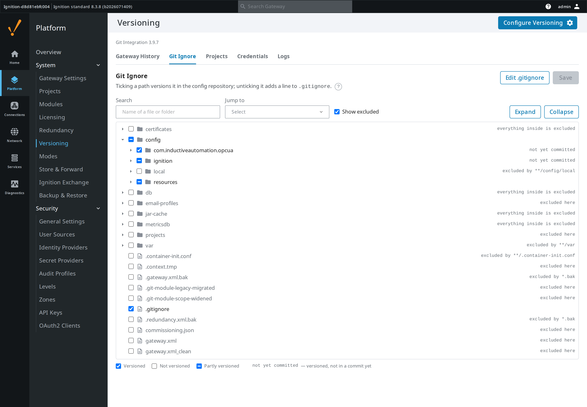
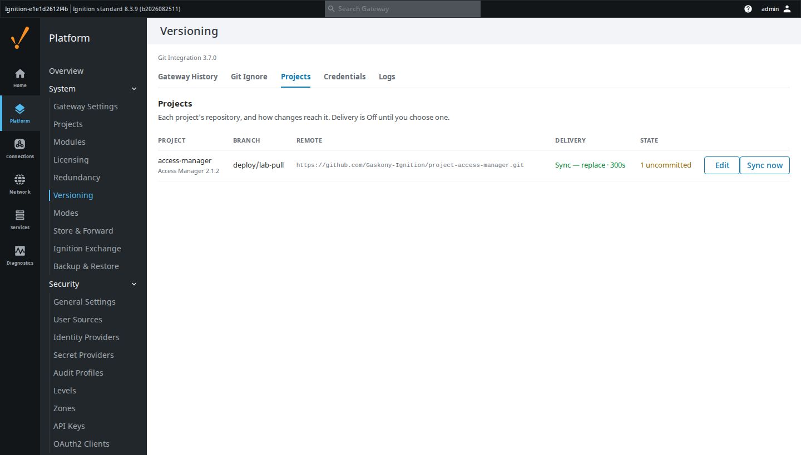
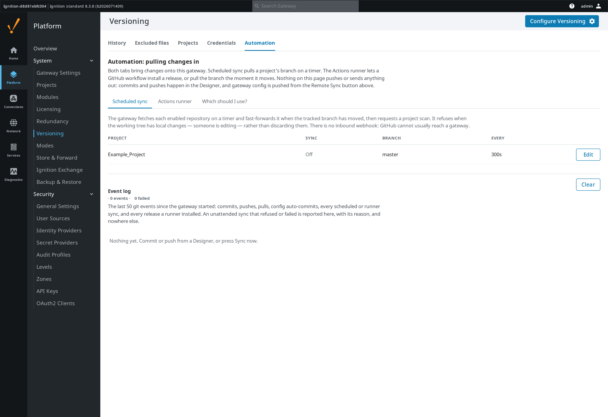
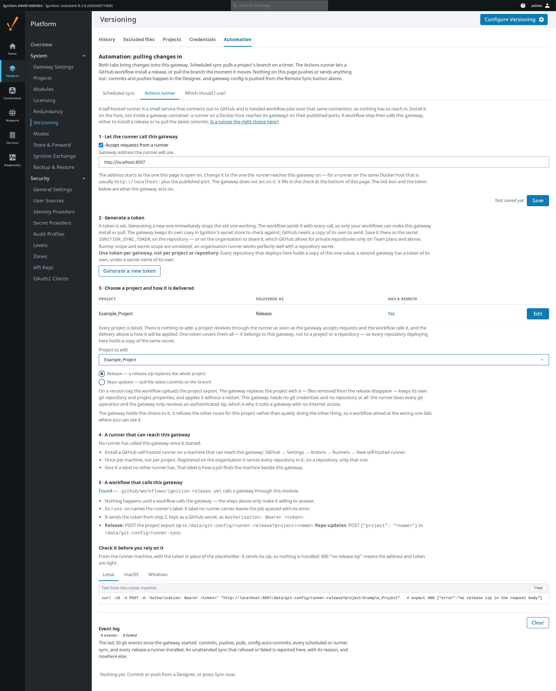
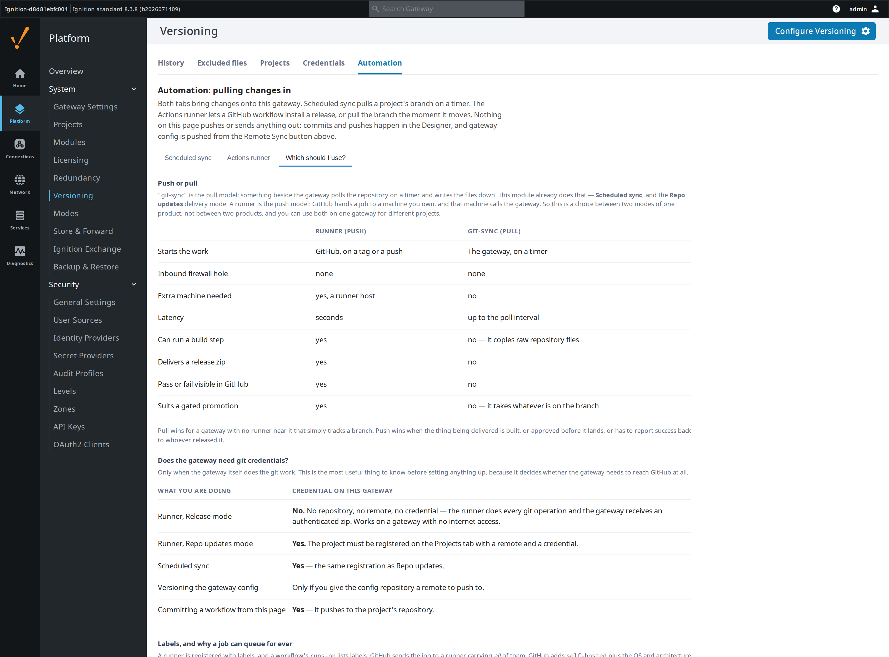

# Git Integration

Version control for Ignition 8.3 — project resources from the Designer, gateway
configuration from the gateway. A Gaskony build of
[OperaMetrix's Git module](https://github.com/operametrix/ignition-git-module),
under the Beerware licence.

## Why this exists

Two people editing the same gateway is two people overwriting each other, and a
gateway backup is a snapshot, not a history: it cannot tell you what changed
between Tuesday and Friday or who changed it. Ignition has no built-in answer,
so the answer is the one every other trade already uses — put it in git.

Upstream covers the Designer half well. This build adds what was missing in
practice: seeing at a glance which resources you have not committed, controlling
what the gateway-config repository actually versions (so a repo never silently
fills with SQLite databases and log files), and answering from the gateway
itself which projects are in git at all.

It also stops git being a thing you only do by hand. A branch can come back
down onto the gateway on a schedule, or the moment it moves on GitHub, without
anyone opening a Designer.

## What it looks like

Uncommitted work is marked in the Project Browser, so you find it without
opening the Commit panel. Green is new, amber is changed, and a folder carries
the state of what is inside it — red if something under it was deleted, since a
deleted resource has no tree node of its own to mark.


The gateway's Versioning page decides what config-as-code covers. The tree is
rooted at `config/`, because that is the only thing the repository versions, and
a ticked row is a versioned one. Rows struck through are excluded, with the
`.gitignore` rule that excluded them shown on the right.



Which projects are under version control is answerable from the gateway, without
opening a Designer and without knowing where to look. Unversioned projects are
listed too — "not in git" and "not on this gateway" are otherwise
indistinguishable — and any of them can be initialised or given a remote here.



Automation brings changes onto this gateway — it never pushes. Scheduled sync
fetches each project's remote on a timer and fast-forwards it when the tracked
branch moves; the Actions runner lets a GitHub workflow install a release or
pull the branch, with nothing reaching in. The event log below records every
commit, push, pull, config auto-commit, sync and release, successes and failures
alike — including an unattended one that refused or failed, and why.



A release does not need a person at the gateway. A GitHub Actions self-hosted
runner on the host connects out to GitHub and is handed workflow jobs over that
same connection, so a workflow can hand this gateway a release — or ask it to
pull a branch — with nothing reaching in. Each project picks **Release** (a zip
replaces the whole project, applied without a restart) or **Repo updates** (pull
the branch). The tab holds the gateway's side — accept runner requests, the
address, the token, each project's delivery — and lists what GitHub's side
needs: a runner with a label of its own, and a workflow that calls the gateway.
It reports what is already in place (when a runner last called, which workflows
the repository has) and gives a check to run from the runner machine.



Push or pull is a real choice, and the tab beside it makes it rather than
implying one. git-sync — something polling the repository and writing the files
down — is the pull model, and this module is already that when a project is set
to Repo updates or given a scheduled sync. A runner is the push model, and the
difference that usually decides it is that only push can build, gate, or report
back. The same tab says which combinations need git credentials on the gateway:
a release needs none at all.



## What it does

**In the Designer** — clone or initialise a project repository, manage remotes
and credentials, commit from a dockable panel with per-resource selection, amend
the last commit, browse history and diffs, and push or pull. Uncommitted
resources are badged in the Project Browser.

**On the gateway** — versions `config/` as code, commits automatically when a
config resource changes, shows history and per-commit diffs, restores a previous
commit, and pushes to a remote. The Excluded files tree edits `.gitignore`
directly: ticking a tracked path also untracks it, and rules you wrote by hand
are never rewritten. Project repositories, the credentials they authenticate
with, and the automation below are all managed from the same page.

**Automation** — pulls changes into this gateway; it never pushes. **Scheduled
sync** fetches each project's remote on a timer and fast-forwards it when the
tracked branch moves, then requests a project scan — polling rather than a
webhook, because GitHub cannot reach most gateways. A sync refuses when the
working tree is dirty rather than discarding someone's unsaved work. For
push-time delivery, the **Actions runner** tab generates the setup for a GitHub
Actions self-hosted runner and opens two token-authenticated routes for it: one
installs a release zip, replacing the project while keeping its git repository
and project properties; the other pulls the branch. The module generates the
configuration but never installs or runs the runner itself. Either tab's
activity, plus every commit, push and pull from the Designer and every config
auto-commit, lands in the **Event log** below both.

This build adds the gateway-side Versioning page, change badges, and inbound
automation on top of upstream 2.1.0 — see [CHANGELOG.md](CHANGELOG.md) for the
full list.

## How to use it

Install the signed `.modl` from the latest release through the gateway's
**Config → Modules → Install or Upgrade Module**, then restart the gateway.

Project versioning: open a project, click **Configure** in the Designer's status
bar, and either clone a remote or initialise locally. Commit from the **Commit**
tab beside the Project Browser.

Gateway config versioning: **Platform → System → Versioning → Initialize
versioning**. Adjust what is covered under **Excluded files**.

Automation: **Platform → System → Versioning → Automation**. On **Scheduled
sync**, press *Set up* for a project, choose a branch and interval, then
*Sync now* — the result appears in the Event log below.

Push-time delivery: **Automation → Actions runner**.

1. Tick *Accept requests from a runner*, and Save. With the token below, this is
   the whole of what the gateway acts on.
2. Generate a token and save it in GitHub as the secret `IGNITION_SYNC_TOKEN` —
   a repository secret, or an organisation secret if the plan allows it. **Keep
   the value.** It is one token per gateway, shown once; every repository that
   deploys here holds a copy of it, and generating a new one immediately stops
   the old one working.
3. Choose the project and **Release** or **Repo updates**. The gateway holds the
   project to that choice and refuses the other route.
4. Have a GitHub self-hosted runner on a machine that can reach this gateway,
   with a label no other runner carries. GitHub's *New self-hosted runner* page
   gives the commands; one runner per machine serves every repository it is
   registered for. The tab says when a runner last called.
5. Have a workflow call the gateway: its `runs-on` names that label, and it
   sends the token to `/data/git-config/runner-release` (Release) or
   `/data/git-config/runner-sync` (Repo updates). Nothing happens until one
   does. The tab lists the repository's workflows and which already call.
6. Set the address the runner reaches this gateway on — for a runner on the same
   Docker host, `http://localhost:` and the published port — and run the test
   command from the runner machine before relying on it.

*Which should I use?* on the same tab compares this with the pull model
(Scheduled sync), and says which modes need git credentials on the gateway —
Release needs none at all.

To build from source you need `gradle.properties` with the signing block —
copy it from `gradle.template.properties` and fill in the keystore details:

```bash
./gradlew build      # -> build/GitIntegration.modl, signed
```

The module version lives in `version.properties` and nowhere else.

## Licence

Beerware (Revision 42) — see [LICENSE.md](LICENSE.md) and `license.html`. The
original notice is retained; this build is modified and distributed by Gaskony.
